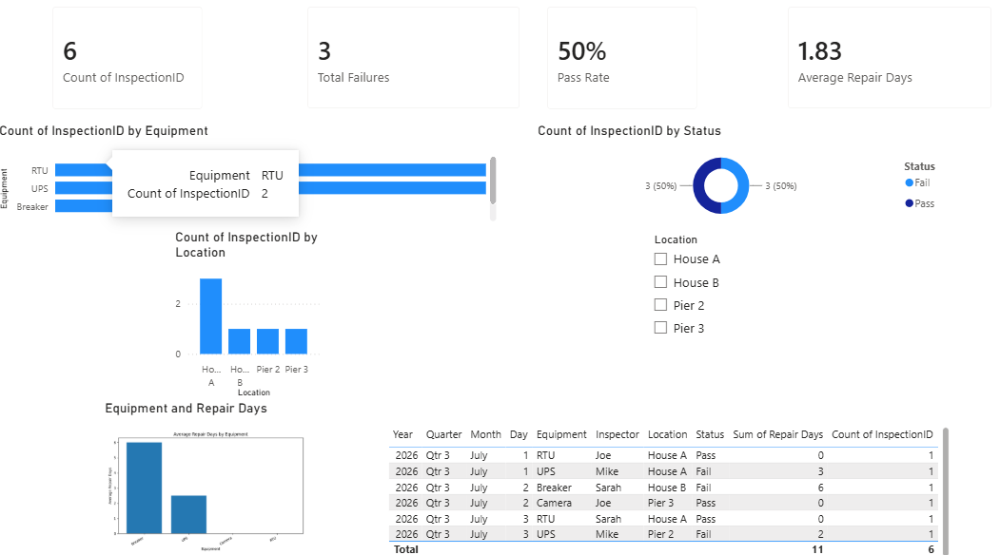

# Electrical Equipment Inspection Dashboard

A Power BI and Python portfolio project for analyzing electrical
equipment inspections, failures, repair durations, and field performance.

## Project Objectives

The dashboard answers the following questions:

- How many inspections were completed?
- What is the inspection pass rate?
- Which equipment types experience the most failures?
- Which locations have the most inspection activity?
- What is the average repair duration?
- How can Python supplement Power BI analysis?

## Tools Used

- Power BI Desktop
- DAX
- Power Query
- Python
- pandas
- Matplotlib
- Git and GitHub

## Dashboard Measures

- Total Inspections
- Total Failures
- Pass Rate
- Average Repair Days

## Python Analysis

The Python script:

1. Loads the inspection CSV file.
2. Validates required columns.
3. Cleans repair-duration values.
4. Calculates inspection and failure totals.
5. Calculates failure rates.
6. Exports an equipment-level summary for Power BI.

Run the script with:

```powershell
python .\python\analyze_inspections.py

Project Structure:
data/          Raw and processed datasets
python/        Python analysis scripts
powerbi/       Power BI project files
screenshots/   Dashboard images

DashBoard Preview:


Author:
Joe Campos
